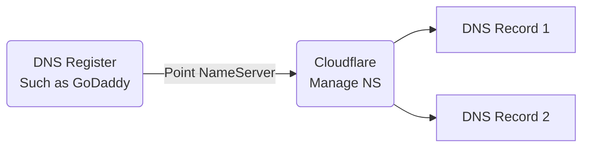

# flowchart

```mermaid
flowchart LR
    DNS(DNS Register \nSuch as GoDaddy) --> |Point NameServer| CF(Cloudflare\nManage NS)
    CF --> Record_1[DNS Record 1]
    CF --> Record_2[DNS Record 2]
```
